# Školní projekt: CHAOS V KOSTCE 
## od Richard Jandíka
Tento  ročníkový projekt je **Minecraft Forge mod pro verzi 1.21.1**.  
Cílem projektu bylo naučit se základy tvorby vlastních bloků, itemů, textur a v budoucnu i mobů
  
  
# Bloky
## Krychlard
Krychlard je velice pohledný blok, který hráči uděluje **Jump Boost**, pokud na něm stojí.  
Zároveň je **kluzký**, což ztěžuje ovládání pohybu.

Blok je možné **otáčet do čtyř směrů**, takže při pokládání lze nastavit směr, kterým „obličej“ bloku směřuje.  
Používá **zvukový typ mokré houby**.

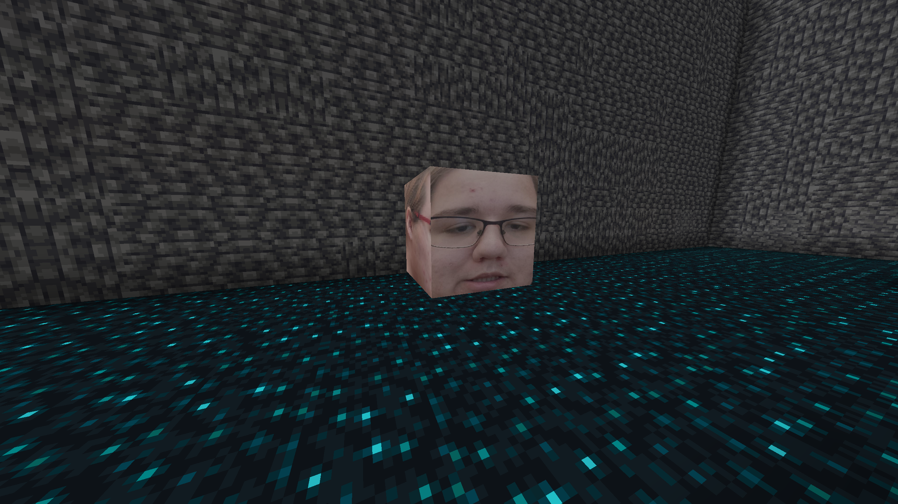 
## Alexandrite bloky
Alexandrite bloky byly vytvořeny jako **testovací bloky** podle tutoriálu, avšak s texturami vytvořené mnou samotným.

Většina těchto bloků používá **zvuky ametystu**, převzaté z tutoriálu. 
Tyto zvuky zůstaly i u některých dalších bloků, především z důvodu lenosti vybrat něco jiného či vytvořit vlastní (do příští verze bude snad opraveno).
U všech bloků by mělo být nastaveno fungují se **silktouchem**.
  
### Alexandrite Ore Block
Alexandrite Ore Block je rudný blok, ze kterého **padá Alexandrite Ore** a expy.  
Tento materiál lze vypéct a použít v crafting receptech.
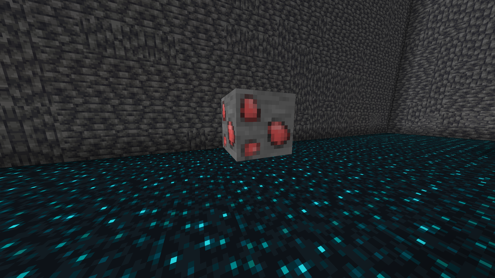 
  
### Alexandrite Block
Alexandrite Block se vyrábí z **9 Alexandrite ingotů** v **3×3 crafting tablu**.  
Slouží jako skladovací a dekorativní blok.
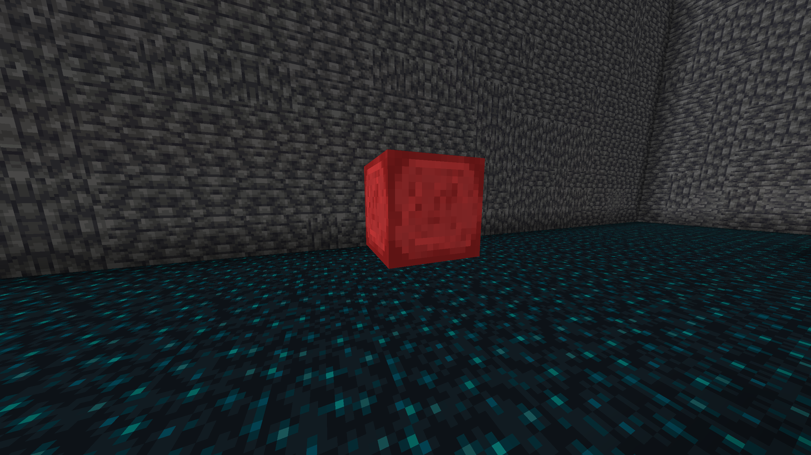 
  
### Tomáš Koláč
Tomáš Koláč měl původně fungovat jako **Deep Slate verze** Alexandrite Ore Blocku.  
Kvůli lenosti autora pro tvorbu textury, nebyla použita Deep Slate textura.
Měl by fungovat na stejném principu jako Alexandrite Ore Block akorát vyžaduje lepší krumpáč.

Blok má místo toho **experimentální texturu „dekomprimovaného Tomáše Koláče“**.  
Do budoucna je plánována změna textury.
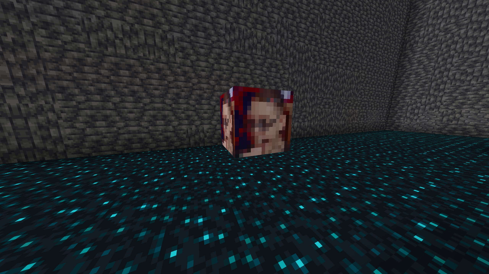 
  
  
# 3D bloky

3D bloky byly pokusem o vytvoření bloků s **vlastním modelem místo klasické krychle**.
Byl použit program Blockbench na tvorbu modelů.

Byly vytvořeny tři různé 3D bloky, avšak pouze **Mikrofon** funguje na **100 % správně**.  
Ostatní bloky sloužily především jako experiment.

### Krtek
Jakožto reference na krtečka jsem doufal že bude fungovat ale bohužel se tak nestalo.
hádám že u něj jsou pravděpodobně špatně pojmenované textury a proto je nemůže najít, model však funguje.
také u něho ještě není nastaveno aby z ostatních bloků okolo něj nedělal průhledné díry.
  
### Krtek vyzobrazený bez funkční textury:
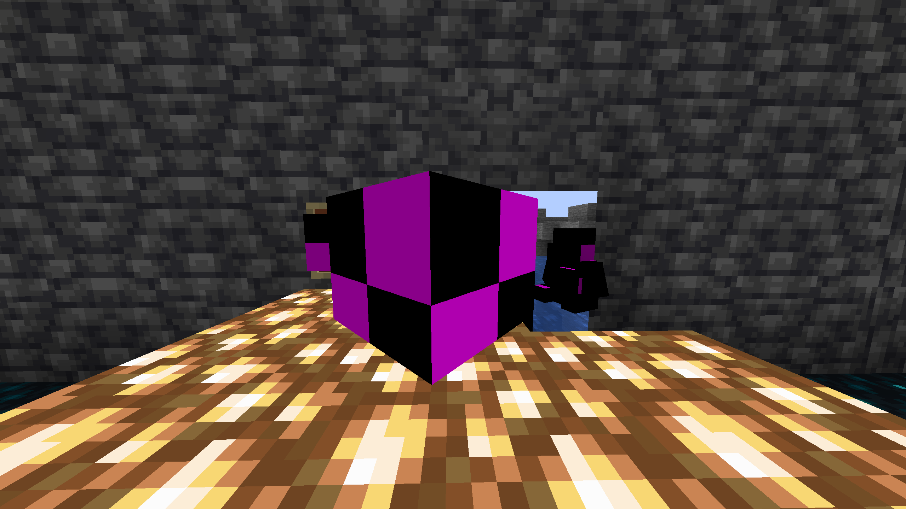 
  
### Původní Model s Texturou:
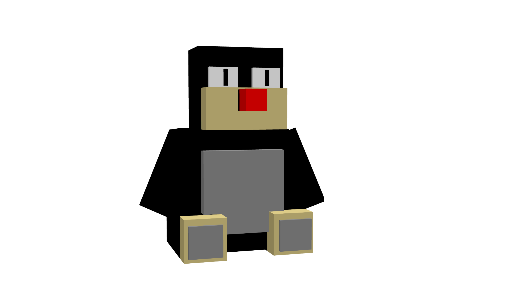 
  
### Blok Mikrofonu
Blok Mikrofonu je jediný 100% funkčí v rámci možností . . .
Z důvodu toho že když se dají 4 tyto Bloky vedle sebe tak jsem mu dal schopnost svítit aby stín co mezzi sebou vytváří neexistoval.
Bohužel to nepomohlo tak jsem se rozhodnul dát svítivost na vyšší čísla teď rozzařuje jeho okolí.
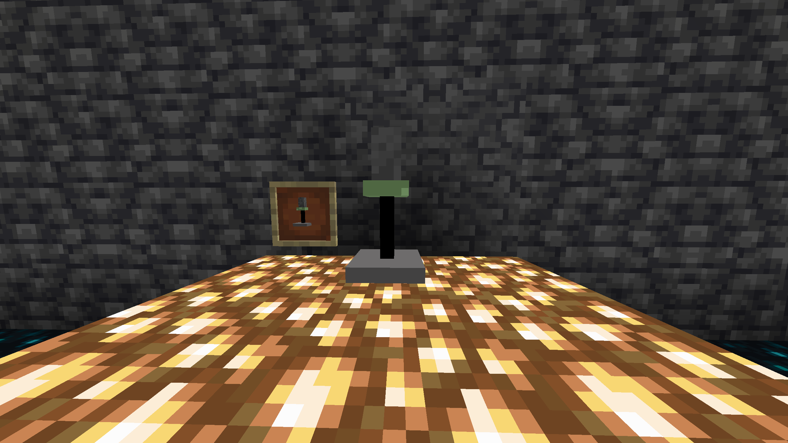 
  
### Prostor před Mikrofonem:
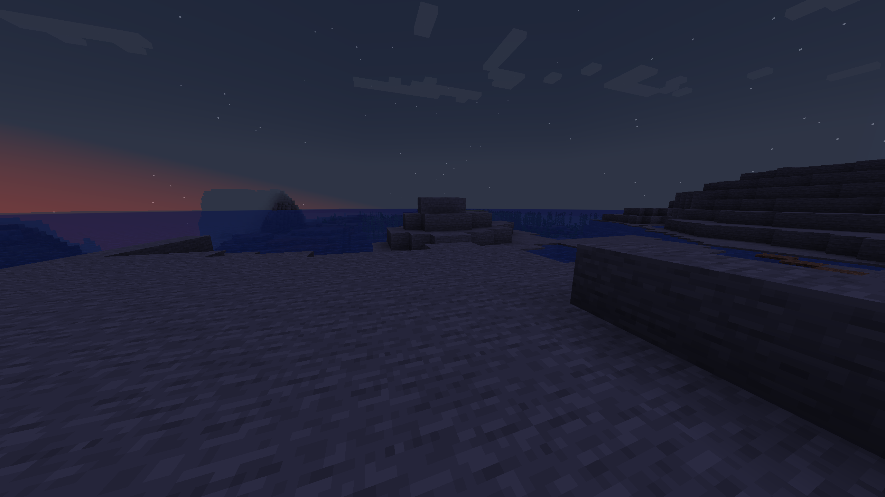 
  
Prostor po Mikrofonu:
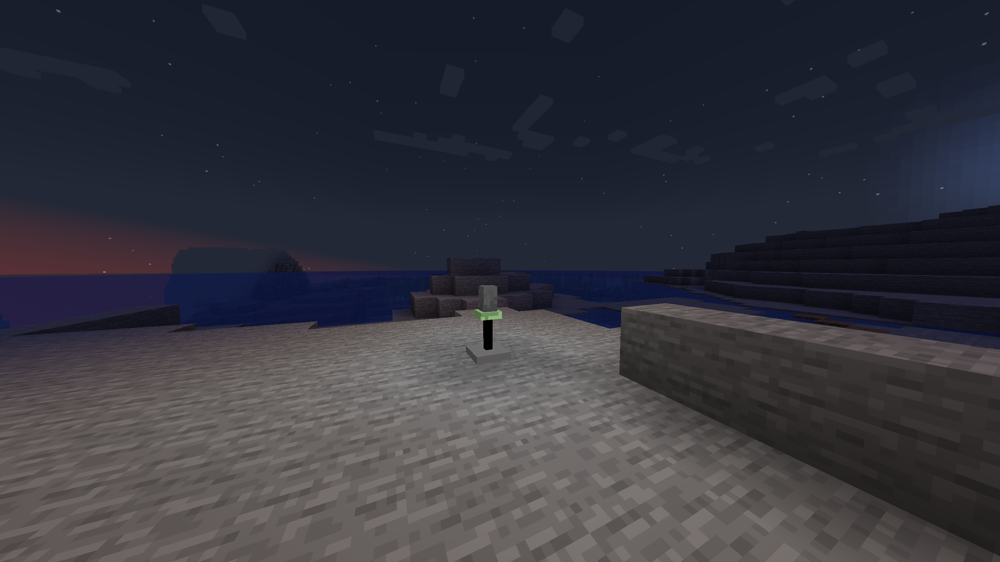 
---
  
# Itemy
## Katana z prvníhopohledu
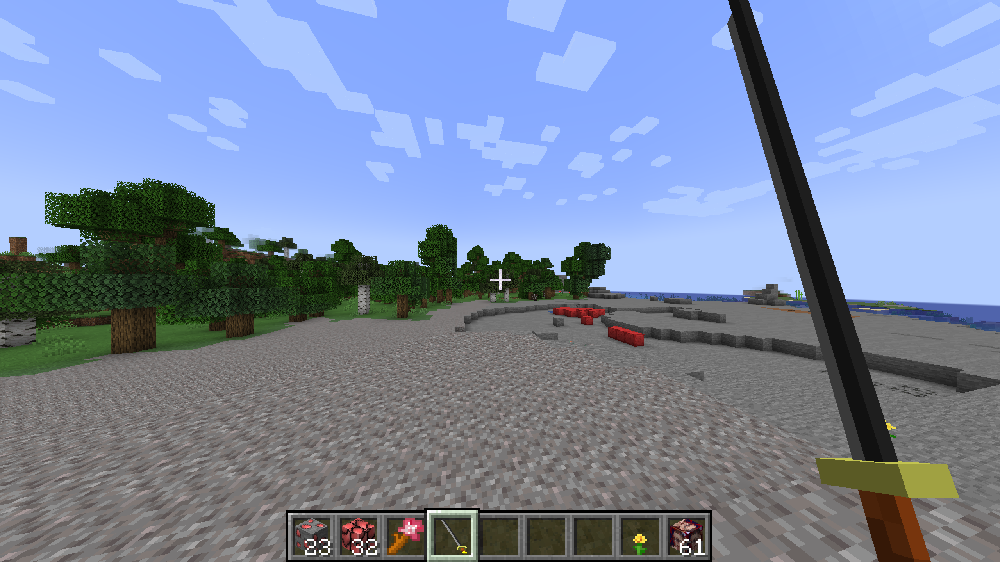 
---

## Katana z druhé osoby
 

---
## Katana dropnutá na zem má trochu jinou velikost než v ruce
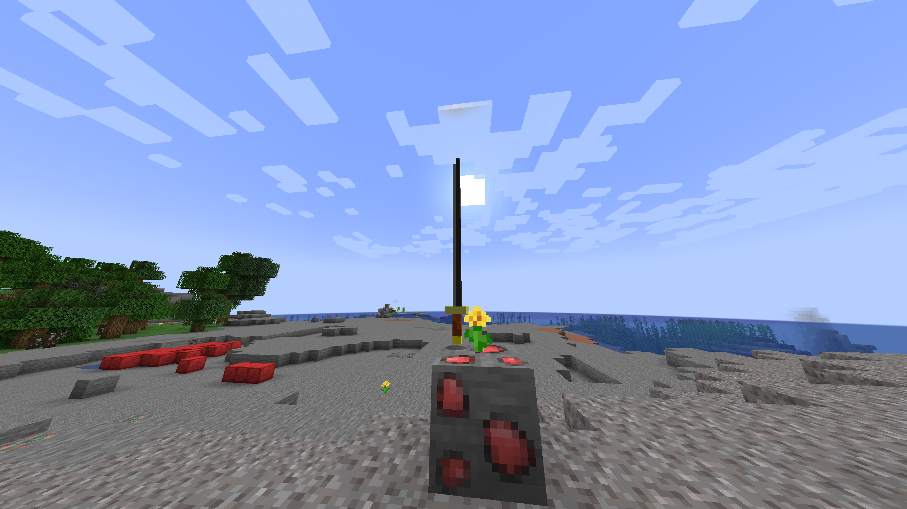 

# Zdroje 
1. Forge Modding Tutorial - Minecraft 1.21: Getting Started | #1 [@ModdingByKaupenjoe]. Online. 2024. Dostupné z: YouTube, https://youtu.be/eFofdJ1BYYs?si=Crx16jjQdbTQzFOT. [cit. 2025-12-16].
2. OpenAI. ChatGPT [online]. 2025 [cit. 16. 12. 2025]. Dostupné z: https://chat.openai.com/

