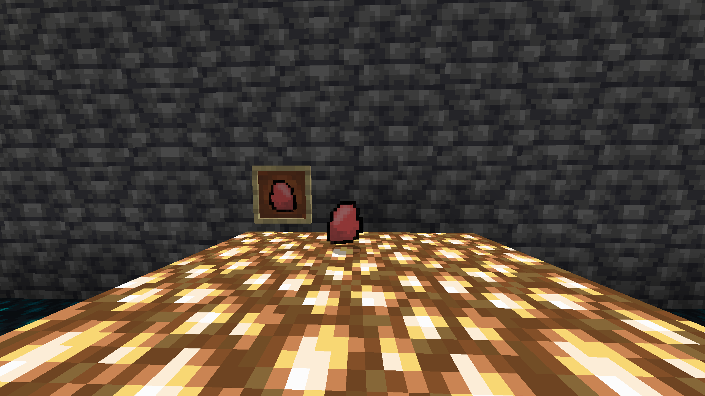
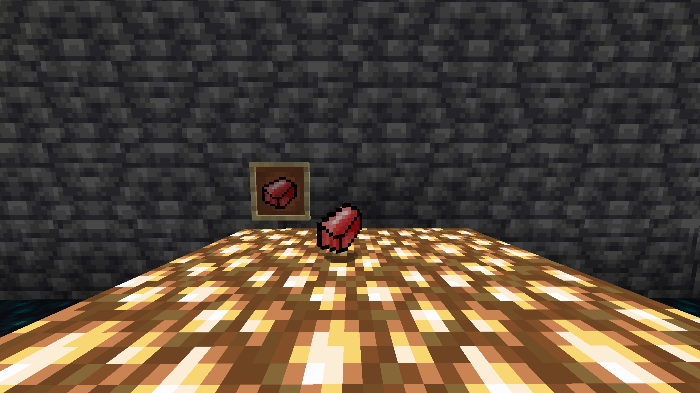
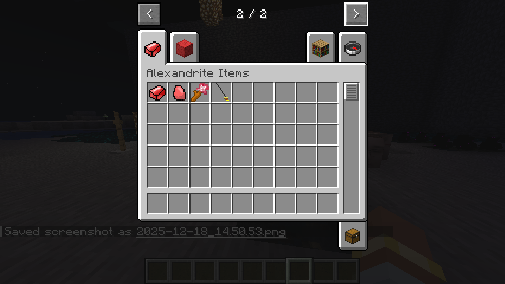
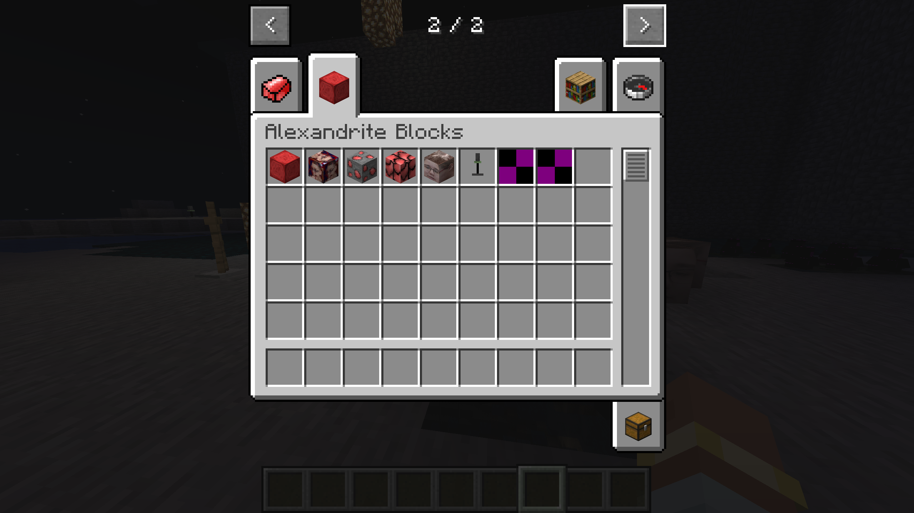

# Školní projekt: CHAOS V KOSTCE 
## od Richarda Jandíka
# Cíl projektu
Cílem ročníkového projektu je vytvořit vlastní Minecraft Forge mod pro verzi 1.21.1,
který rozšíří hru o nové bloky a itemy s vlastním chováním, texturami a modely.

# Použité návody a vlastní úpravy
Projekt vychází z veřejně dostupných tutoriálů na modování Minecraft Forge.

Moje vlastní práce:
- návrh a tvorba vlastních textur,
- návrh a tvorba 3D modelů v Blockbench,
- úprava chování bloků (efekty, svícení, orientace),
- rozšíření projektu o vlastní nápady mimo rámec tutoriálu.

Oproti původním návodům:
- byly přidány vlastní bloky a itemy,
- byly změněny vlastnosti bloků,
- byly řešeny chyby při práci s modely a texturami.

Projekt slouží k osvojení:
- práce s jazykem Java,
- základů modování Minecraftu (Forge),
- práce s 3D modely a texturami,
  
# Současný stav projektu
Projekt je ve fázi funkčního prototypu.

Aktuálně obsahuje:
- vlastní bloky (klasické i 3D),
- vlastní itemy,
- vlastní creative taby,
- experimentální funkce (svícení, efekty, orientace bloků).

Některé prvky jsou záměrně nedokončené a budou dále rozpracovány ve druhém pololetí.
  
# Bloky
## Krychlard
Krychlard je velice pohledný blok, který hráči uděluje **Jump Boost**, pokud na něm stojí.  
Zároveň je **kluzký**, což ztěžuje ovládání pohybu.

Blok je možné **otáčet do čtyř směrů**, takže při pokládání lze nastavit směr, kterým „obličej“ bloku směřuje.  
Používá **zvukový typ mokré houby**.

 
## Alexandrite bloky
Alexandrite bloky byly vytvořeny jako **testovací bloky** podle tutoriálu, avšak s texturami vytvořené mnou samotným.

Většina těchto bloků používá **zvuky ametystu**, převzaté z tutoriálu. 
Tyto zvuky zůstaly i u některých dalších bloků, především z důvodu lenosti vybrat něco jiného či vytvořit vlastní (do příští verze bude snad opraveno).
U všech bloků by mělo být nastaveno fungují se **silktouchem**.
  
### Alexandrite Ore Block
Alexandrite Ore Block je rudný blok, ze kterého **padá Alexandrite Ore** a expy.  
Tento materiál lze vypéct a použít v crafting receptech.
 
  
### Alexandrite Block
Alexandrite Block se vyrábí z **9 Alexandrite ingotů** v **3×3 crafting tablu**.  
Slouží jako skladovací a dekorativní blok.
 
  
### Tomáš Koláč
Tomáš Koláč měl původně fungovat jako **Deep Slate verze** Alexandrite Ore Blocku.  
Kvůli lenosti autora pro tvorbu textury, nebyla použita Deep Slate textura.
Měl by fungovat na stejném principu jako Alexandrite Ore Block akorát vyžaduje lepší krumpáč.

Blok má místo toho **experimentální texturu „dekomprimovaného Tomáše Koláče“**.  
Do budoucna je plánována změna textury.
 
  
  
# 3D bloky

3D bloky byly pokusem o vytvoření bloků s **vlastním modelem místo klasické krychle**.
Byl použit program Blockbench na tvorbu modelů.

Byly vytvořeny tři různé 3D bloky, avšak pouze **Mikrofon** funguje na **100 % správně**.  
Ostatní bloky sloužily především jako experiment.

### Krtek
Jakožto reference na krtečka jsem doufal že bude fungovat ale bohužel se tak nestalo.
hádám že u něj jsou pravděpodobně špatně pojmenované textury a proto je nemůže najít, model však funguje.
také u něho ještě není nastaveno aby z ostatních bloků okolo něj nedělal průhledné díry.
  
### Krtek vyzobrazený bez funkční textury:
 
  
### Původní Model s Texturou:
 
  
### Brňák Statue
Brňák statue je blok u kterého mi nefungovalo absolutně nic, takže jsem nad ním zlomil hůl.
Jeho čirá existence je akorát fialovo-černá ohavnost
### Původní nápad s modelem a texturou
 
  
### Blok Mikrofonu
Blok Mikrofonu je jediný 100% funkčí v rámci možností . . .
Z důvodu toho že když se dají 4 tyto Bloky vedle sebe tak jsem mu dal schopnost svítit aby stín co mezzi sebou vytváří neexistoval.
Bohužel to nepomohlo a tak jsem se rozhodnul mu dát svítivost na vyšší čísla a teď rozzařuje jeho okolí.
 
  
### Prostor před Mikrofonem:
 
  
Prostor po Mikrofonu:
 
---
  
# Itemy
## Katana
Katana byl pokus o vytvoření 3D itemu.
Bohužel k meči má jen podobný tvar. Zatím jsem mu ještě nedokázal dát vlastnosti zbraně takže pokud ho hráč bude chtít použít jako zbraň tak bude sklamán z toho že jeho DMG se neliší od normálního bouchnutí rukou.
  
### Katana z prvníhopohledu:
 
  
## Katana z druhé osoby:
 
  
## Katana dropnutá na zem:
 
  
## Alexandrite Ore
 
  
## Alexandrite Ingot
 

# Creative Taby 
Jedině creative módu je možné celkově momentálně získat Cokoliv co jsem vytvořil takže jsem musel vytvořit nové taby jen na obsah mého módu 
## Tab na Itemy:
 
  
## Tab na Bloky:
 
  

# Zdroje 
1. Forge Modding Tutorial - Minecraft 1.21: Getting Started | #1 [@ModdingByKaupenjoe]. Online. 2024. Dostupné z: YouTube, https://youtu.be/eFofdJ1BYYs?si=Crx16jjQdbTQzFOT. [cit. 2025-12-16].
2. OpenAI. ChatGPT [online]. 2025 [cit. 16. 12. 2025]. Dostupné z: https://chat.openai.com/

